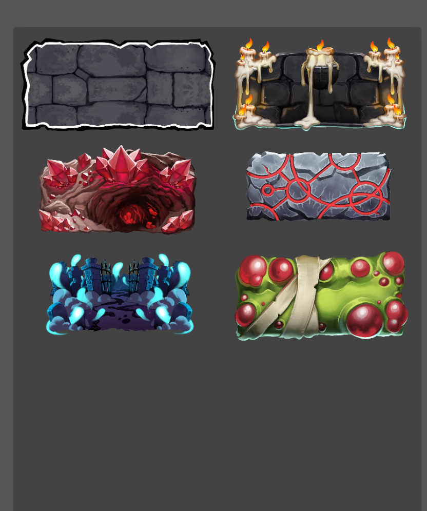

# Changelog v0.13

Siamo felici di presentarvi la quarta Settimana del Contenuto di Towers of Minduir!

E’ la più grande release di ToM finora, e non vediamo l’ora di condividere i cambiamenti

# Etichette giocatore

Sono disponibili delle etichette del giocatore personalizzate! (appaiono in alto a destra durante un match)

 

Tutto quello che serve per riceverle e’ invitare nuove persone!

## Inviti

**Basta entrare nel menu di gioco, premere sull’icona dell’ingranaggio in alto a destra, e premere sul testo sottolineato**. Una nuova etichetta verrà sbloccata al decimo match completato dell’invitato

# Frag Cannon

E’ nuova, e’ di legno e speriamo che vi piaccia quanto piace a noi! Il Frag Cannon e’ un nuovo tipo di carta: **una Struttura**.

## Strutture

Le strutture, in contrasto alle unita’ ed alle spells, **bloccano parte della rigenerazione del mana** fino a quando non vengono distrutte, che puo’ accadere in battaglia oppure usando il loro comando.

## Frag Cannon

Il frag cannon e’ una struttura che spara dei proiettili facendo danno AoE in un cono nella direzione dell’attacco

# Bugfixes

* Risolto un bug che faceva attribuire la vittoria al giocatore sbagliato
