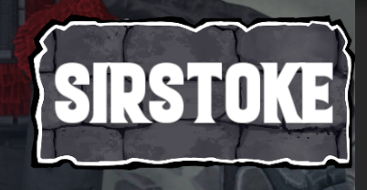
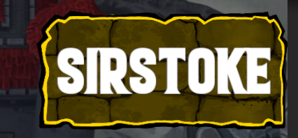
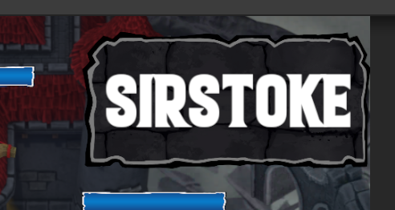
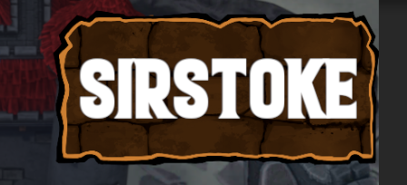

title: Changelog ToM v0.3
---

# Changelog v0.3

Siamo felici di annunciare che Towers of Minduir alternera' due tipi di aggiornamenti per ogni settimana:

- Settimana del Contenuto: la amiamo tutti. Nuove carte (👀), cosmetici, eventi, funzionalita' etc.
- Settimana del Bilanciamento: lavoriamo duro affinche' non ci siano sbilanciamenti, ma purtroppo spesso facciamo errori. La Settimana del Bilanciamento servira' ad aggiustare la mira sul meta esistente in caso divenisse troppo stantio o sbilanciato

Benvenuti alla prima Settimana del Contenuto di ToM!

Menu
====

Classifica
----------

Fanfara riecheggia, abbiamo aggiunto una classifica globale! **o**gni giocatore avra' un punteggio basato sulle proprie vittorie e sconfitte, i punteggi sono calcolati in questo modo:

```
+100 -20 fino a 1000 pt
+75 -40 tra 1000 e 2500 pt
+50 -60 tra 2500 e 4000 pt
+25 -80 da 4000 pt in poi
```

Raffazzonate i vostri deck, buona fortuna!

Miglioramenti al deck builder
-----------------------------

Attanagliate ed aggiunte delle statistiche (danno, velocita' e hp) alla descrizione delle carte

In-match
========

Mana
----

Giubilamente aggiunto un contatore testuale del mana nell'hud

Badge del nome
--------------

Canonizzato ed aggiunto un badge nell'hud che contiene il nome dell'avversario corrente - il badge diventa colorato se l'avversario e' top 3 nella classifica globale:

**n**ormale:



**p**rimo posto:



**s**econdo posto:



**t**erzo posto:



Audio
-----

Annessa una sgargiante soundtrack durante il match! **c**ome al solito ogni feedback e' molto apprezzato!

Bugfixes
========

- Neutralizzata leggermente la sensibilita' delle notifiche. **c**ontinuiamo a lavorarci costantemente, ogni feedback e' sempre ben accetto!
- NON esistate a contattarci per qualsiasi motivo attraverso i canali che conoscete

👀
==
