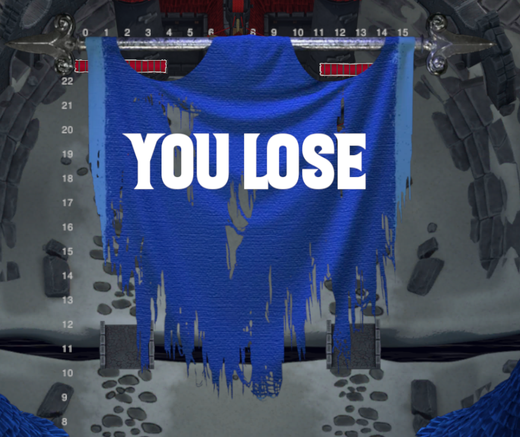

# Changelog v0.9

Siamo felici di presentarvi la terza Settimana del Contenuto di Towers of Minduir!

## Tempo di attesa

Abbiamo implementato un indicatore che mostra il tempo di attesa medio durante il matchmaking: 

## Stendardi

Abbiamo riempito lo spazio vuoto alla fine del match! Ora verranno presentati degli stendardi che indicano il risultato del match.

Vittoria:

Sconfitta:

## Bugfixes

- Risolto un bug sull'attribuzione della vittoria
- Risolto un glitch sul tasto del matchmaking innescato dalla navigazione del menu durante la ricerca
